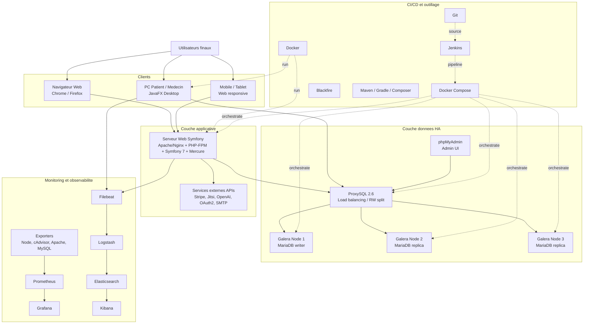
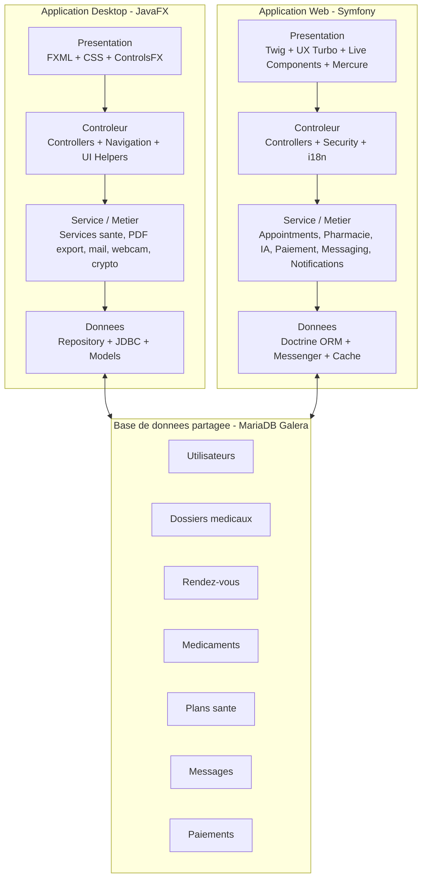

# SANTEA - ## Environnement de développement

## Stack technique
- Symfony 6.4
- PHP 8.1
- Cluster MariaDB Galera 11.4 (compatible protocole MySQL)
- phpMyAdmin
- Apache
- JavaFX (OpenJDK 17)

## Architecture physique




## Architecture logique


Si l'image ne s'affiche pas encore, ajoutez le fichier dans le projet a ce chemin:
- docs/architecture/architecture-logique.png



## Démarrage rapide

### 1. Démarrer les conteneurs Docker
```bash
docker-compose up -d
```

Si vous migrez depuis l'ancienne version mono-instance MySQL, faites d'abord:
```bash
docker-compose down --remove-orphans
docker-compose up -d
```

### 2. Installer Symfony 6.4
```bash
docker-compose exec web composer create-project symfony/skeleton:"6.4.*" temp
docker-compose exec web sh -c "mv temp/* temp/.* . 2>/dev/null || true && rm -rf temp"
docker-compose exec web composer require webapp
```

### 3. Accès aux services
- **Application Symfony**: http://localhost:8000
- **phpMyAdmin**: http://localhost:8080
  - Serveur: db
  - Utilisateur: root
  - Mot de passe: root

### 3.bis Monitoring + Logs (Prometheus, Grafana, ELK)
```bash
# Démarrer la stack observabilité
docker-compose --profile observability up -d

# Provisionner le dashboard Kibana (logs Symfony + JavaFX)
bash /home/pi-dev/PIDEV/observability/kibana/provision-kibana-dashboard.sh
```

- **Prometheus**: http://localhost:9090
- **Grafana**: http://localhost:3001 (admin/admin)
- **Kibana**: http://localhost:5601
- **Elasticsearch API**: http://localhost:9200

Dans Kibana, utilisez le dashboard **PIDEV Logs Overview**.
Le dashboard contient 4 volets: All, Symfony, JavaFX et Database.

Sources observées:
- **Monitoring Symfony**: métriques Apache via `apache-exporter` (`/server-status`)
- **Monitoring JavaFX**: métriques conteneur (CPU/RAM/restarts) via `cadvisor`
- **Logs Symfony**: `symfony-app/var/log/*.log`
- **Logs JavaFX**: `javafx-app/logs/javafx-app.log`

### 4. Base de données
- Host: db (depuis les conteneurs) ou localhost:3306 (depuis l'hôte)
- Endpoint `db`: ProxySQL (rw split) vers le cluster Galera (db-node1, db-node2, db-node3)
- Database: pidev
- User: symfony
- Password: symfony
- Root password: root

Ports utiles:
- `3306`: endpoint SQL applicatif via ProxySQL (`db`)
- `6032`: admin ProxySQL (local host uniquement)

Comportement RW split ProxySQL:
- `INSERT/UPDATE/DELETE/...` -> writer Galera
- `SELECT` -> pool lecture sur noeuds backup-writer Galera (hostgroup 30)
- Exceptions (ex: `SELECT LAST_INSERT_ID()`) forcees sur writer

Vérification rapide du cluster:
```bash
# Demarrage fiable du cluster (bootstrap ordonne)
COMPOSE_CMD=docker-compose bash /home/pi-dev/PIDEV/scripts/galera/start-cluster.sh

# En cas d'etat Galera persistant corrompu/non-primary
RESET_GALERA_VOLUMES=1 COMPOSE_CMD=docker-compose bash /home/pi-dev/PIDEV/scripts/galera/start-cluster.sh

# Taille du cluster (attendu: 3)
docker-compose exec db-node1 mysql -uroot -proot -e "SHOW STATUS LIKE 'wsrep_cluster_size';"

# État du cluster (attendu: Primary)
docker-compose exec db-node1 mysql -uroot -proot -e "SHOW STATUS LIKE 'wsrep_cluster_status';"

# Validation du proxy SQL (attendu: ok=1)
docker-compose exec db-node2 mariadb --ssl=0 -h db -P 3306 -uroot -proot -e "SELECT 1 AS ok;"
```

### 4.bis Migration complete old MySQL -> Galera

Le script suivant automatise dump + import + verification:

```bash
bash /home/pi-dev/PIDEV/scripts/migrate-old-mysql-to-galera.sh
```

Variables supportees (optionnelles):

```bash
OLD_MYSQL_HOST=127.0.0.1
OLD_MYSQL_PORT=3306
OLD_MYSQL_USER=root
OLD_MYSQL_PASSWORD=root
OLD_MYSQL_DATABASE=pidev
OLD_MYSQL_DOCKER_NETWORK=
TARGET_GALERA_SERVICE=db-node1
TARGET_DATABASE=pidev
```

Exemple complet:

```bash
OLD_MYSQL_HOST=10.10.0.15 \
OLD_MYSQL_PORT=3306 \
OLD_MYSQL_USER=root \
OLD_MYSQL_PASSWORD='oldRootPass' \
OLD_MYSQL_DATABASE=pidev \
TARGET_GALERA_SERVICE=db-node1 \
TARGET_DATABASE=pidev \
bash /home/pi-dev/PIDEV/scripts/migrate-old-mysql-to-galera.sh
```

Le script:
1. Genere un dump MySQL source
2. Cree la base cible si necessaire
3. Importe dans le writer Galera
4. Verifie le nombre de tables source/cible
5. Verifie l'etat wsrep du cluster

## Commandes utiles

### Jenkins CI/CD
Le projet inclut un pipeline Jenkins declaratif dans `Jenkinsfile`.

Pipelines disponibles:
1. `Jenkinsfile` (pipeline principal): build/tests + verification cluster Galera + smoke ProxySQL.
2. `Jenkinsfile.galera-ha` (pipeline dedie): failover test + migration old MySQL optionnelle + observabilite.

Pre-requis Jenkins agent:
- Docker
- docker-compose (v1)
- Acces au daemon Docker (`/var/run/docker.sock`)

Creation job Jenkins:
1. Nouveau job `Pipeline`.
2. `Pipeline script from SCM`.
3. SCM `Git` vers ce repository.
4. Script path: `Jenkinsfile`.

Parametres pipeline:
- `RUN_TESTS`: execute les tests Symfony et JavaFX.
- `ENABLE_OBSERVABILITY`: demarre Prometheus/Grafana/ELK et provisionne Kibana.
- `CLEANUP_AFTER_BUILD`: stoppe les conteneurs en fin de run.

Parametres pipeline dedie `Jenkinsfile.galera-ha`:
- `RUN_DATA_MIGRATION`: active la migration old MySQL -> Galera.
- `OLD_MYSQL_HOST`, `OLD_MYSQL_PORT`, `OLD_MYSQL_USER`, `OLD_MYSQL_PASSWORD`, `OLD_MYSQL_DATABASE`.
- `OLD_MYSQL_DOCKER_NETWORK` (si la source est joignable seulement via un reseau Docker specifique).
- `ENABLE_OBSERVABILITY`, `CLEANUP_AFTER_BUILD`.

Etapes pipeline:
1. Verification outillage Docker/Compose.
2. Build images `web` et `javafx`.
3. Demarrage cluster Galera + ProxySQL.
4. Bootstrap users monitoring (`monitor`/`exporter`) + check wsrep.
5. Validation Symfony (`composer install`, lint yaml).
6. Tests Symfony (si actives).
7. Build JavaFX Maven.
8. Tests JavaFX (si actives).
9. Deploiement observabilite (si active).
10. Smoke checks HTTP + endpoints observabilite + test SQL via ProxySQL.

### Monitoring Galera wsrep (Prometheus/Grafana)

Le profil `observability` inclut maintenant:
- `mysql-exporter-node1`
- `mysql-exporter-node2`
- `mysql-exporter-node3`

Si les exporters redemarrent en boucle, verifier que les users `monitor` et `exporter`
existent bien avec:

```bash
COMPOSE_CMD=docker-compose bash /home/pi-dev/PIDEV/scripts/galera/ensure-galera-users.sh
```

Dashboard Grafana ajoute:
- `PIDEV Galera wsrep`

Commande de demarrage:

```bash
docker-compose --profile observability up -d
```

### Symfony
```bash
# Entrer dans le conteneur web
docker-compose exec web bash

# Créer une entité
docker-compose exec web php bin/console make:entity

# Créer une migration
docker-compose exec web php bin/console make:migration

# Exécuter les migrations
docker-compose exec web php bin/console doctrine:migrations:migrate

# Créer un contrôleur
docker-compose exec web php bin/console make:controller
```

### JavaFX
```bash
# Mode 1: X11 local (nécessite xhost)
# Entrer dans le conteneur JavaFX
docker-compose exec javafx bash

# Lancer l'application JavaFX (Maven)
docker-compose exec javafx mvn javafx:run

# Compiler uniquement
docker-compose exec javafx mvn -DskipTests compile
```

Pour centraliser les logs JavaFX dans ELK, utilisez de préférence le script:

```bash
bash /home/pi-dev/PIDEV/javafx-app/scripts/run-javafx.sh
```

```bash
# Mode 2: Xpra (sans xhost, accès navigateur)
docker-compose up -d javafx-xpra
xdg-open http://localhost:14500/index.html
```

Le mode Xpra lance JavaFX dans un display virtuel et expose l'interface via navigateur.

### Lancer JavaFX via une shortcut Bureau + autostart

Si vous voulez lancer la meme application que `mvn -q javafx:run` via une icone Bureau:

```bash
bash /home/pi-dev/PIDEV/scripts/install-javafx-shortcut.sh
```

Ce script cree:
- `~/Desktop/santea-javafx.desktop` (shortcut Bureau)
- `~/.config/autostart/santea-javafx.desktop` (ouverture automatique a la connexion Linux)

La commande executee est:

```bash
/home/pi-dev/PIDEV/javafx-app/scripts/run-javafx.sh
```

Cette commande lance bien Maven en mode local avec:

```bash
mvn -q javafx:run
```

### Deux shortcuts separes (Windows + VM)

Objectif:
- Une shortcut Windows qui ouvre seulement JavaFX.
- Une shortcut Linux dans la VM qui ouvre JavaFX dans la VM.

Shortcut Windows (native):
1. La VM doit avoir l'autologin Linux + autostart JavaFX deja configures.
2. Depuis Windows, executer:

```powershell
powershell -ExecutionPolicy Bypass -File .\scripts\windows\create-javafx-shortcut-windows.ps1
```

3. Une icone Bureau `SanteA JavaFX.lnk` est creee.
4. Double-clic sur cette icone: la VM se lance en GUI, puis JavaFX s'ouvre automatiquement dans la VM.

Shortcut dans la VM Linux:

```bash
bash /home/pi-dev/PIDEV/scripts/install-javafx-shortcut.sh
```

Cette commande cree l'icone `~/Desktop/santea-javafx.desktop` dans la VM.

### Installateur Windows `.exe` (prerequis + auto-update Git)

Objectif:
- Generer un vrai installateur Windows `.exe`.
- Installer automatiquement les prerequis manquants (Git).
- Synchroniser le code depuis une branche Git precise a chaque lancement.
- Lancer JavaFX en local sur Windows.

Fichiers utilises:
- `scripts/windows/installer/SanteAInstaller.iss`
- `scripts/windows/installer/Install-SanteA.ps1`
- `scripts/windows/installer/SanteA-Launcher.ps1`
- `scripts/windows/installer/build-installer.ps1`

#### 1. Pre-requis machine de build Windows

- Inno Setup 6 (ISCC.exe)
- PowerShell 5+

#### 2. Generer `SanteA-Setup.exe`

Depuis Windows, dans le repo:

```powershell
powershell -ExecutionPolicy Bypass -File .\scripts\windows\installer\build-installer.ps1 -GitRepoUrl "https://github.com/HoussemLangar/Esprit-PIDEV-3A41-2026-SANTEA.git" -GitBranch "main"
```

Le fichier genere est:
- `scripts/windows/installer/SanteA-Setup.exe`

#### 3. Comportement de l'application installee

Au moment de l'installation:
- Git est installe via `winget` s'il est absent.
- Le projet est clone dans `%LOCALAPPDATA%\SanteA\PIDEV`.
- Le JDK 21 est telecharge en local dans `javafx-app/.jdks`.

A chaque lancement depuis l'icone Desktop/Menu:
- `git fetch` + `reset --hard` sur la branche configuree.
- Mise a jour automatique avant demarrage JavaFX.
- L'icone Windows du raccourci utilise le logo de l'application.
- L'application se lance sans ouvrir de terminal.
- Les identifiants GitHub du depot prive sont integres a l'installateur pour les mises a jour automatiques sans saisie.
- Maven est telecharge localement dans le profil utilisateur si aucun `mvn` n'est disponible.
- La compilation JavaFX est effectuee pendant l'installation et apres une mise a jour Git; le lancement normal utilise directement `target/app/bin/app.exe`.

> Important: pour cette copie geree automatiquement, les modifications locales sont ecrasees a chaque lancement (reset sur la branche distante).

### Docker
```bash
# Voir les logs
docker-compose logs -f web

# Arrêter les conteneurs
docker-compose down

# Arrêter et supprimer les volumes
docker-compose down -v

# Reconstruire les images
docker-compose build --no-cache
```

## Structure du projet
```
PIDEV/
├── docker/                          # Images et configurations des services
│   ├── galera/                      # Init DB + scripts cluster Galera
│   ├── mysql-ha/                    # ProxySQL / HA MySQL
│   ├── php/                         # Image Symfony (Apache/PHP)
│   ├── proxysql/
│   ├── javafx/                      # Image JavaFX
│   └── ssl/
├── symfony-app/                     # Application Web Symfony
│   ├── src/                         # Controllers, Services, Entites
│   ├── templates/                   # Vues Twig
│   ├── config/                      # Config Symfony
│   ├── migrations/                  # Migrations Doctrine
│   ├── public/                      # Assets publics
│   └── tests/
├── javafx-app/                      # Application Desktop JavaFX
│   ├── src/main/                    # Code source Java
│   ├── src/test/                    # Tests Java
│   ├── scripts/                     # Scripts lancement JavaFX
│   ├── logs/                        # Logs app desktop
│   └── pom.xml                      # Build Maven
├── observability/                   # Monitoring + logs centralises
│   ├── prometheus/
│   ├── grafana/
│   ├── logstash/
│   ├── kibana/
│   └── filebeat/
├── scripts/                         # Scripts infra, CI et execution locale
│   ├── ci/
│   ├── galera/
│   └── windows/
├── Jenkinsfile                      # Pipeline principal
├── Jenkinsfile.galera-ha            # Pipeline HA/failover
├── docker-compose.yml               # Orchestration locale complete
├── Makefile
└── README.md
```

Notes de structure:
- `symfony-app/` et `javafx-app/` partagent la meme base MariaDB (via ProxySQL) pour conserver une coherence fonctionnelle entre front web et desktop.
- `observability/` et le profil Docker `observability` sont separes de la stack applicative pour activer le monitoring a la demande.
- `scripts/` centralise l'automatisation (cluster Galera, migration old MySQL, raccourcis desktop, CI).
